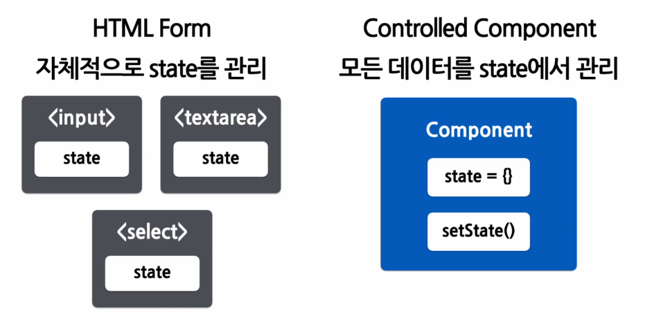

# Form

- 사용자로부터 입력을 받기 위해 사용

  ## Controlled Component

  - 값이 리액트의 통제를 받는 Input Form Element
  - 사용자의 입력을 직접적으로 제어할 수 있음.
    

  ## Form의 종류

  ### Textarea 태그

  - 여러 줄에 걸쳐 긴 텍스트를 입력받기 위한 태그

  ### Select 태그

  - Drop-down 목록을 보여주기 위한 태그

  ### File input 태그

  - 디바이스의 저장 장치로부터 하나 또는 여러 개의 파일을 선택할 수 있게 해주는 태그
