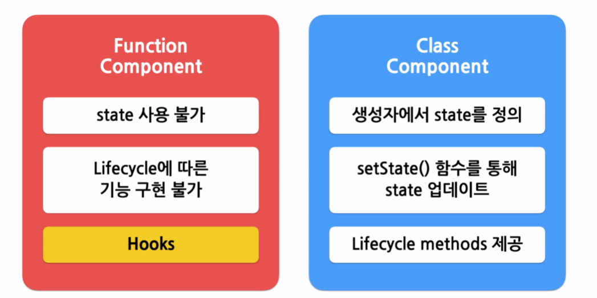

# Hooks



- 훅을 사용하면 함수 컴포넌트도 클래스 컴포넌트의 기능을 동일하게 사용 가능

  ## useState()

  - state를 사용하기 위한 Hook
  - 변수 각각에 대해 set함수가 따로 존재

  ```JavaScript
  const [변수명, set함수명] = useState(초기값);
  ```

  ## useEffect()

  - Side effect를 수행하기 위한 Hook

  ```JavaScript
  useEffect(이펙트 함수, 의존성 배열);
  ```

  ```JavaScript
    useEffect(() => {
        // 컴포넌트가 마운트 된 이후,
        // 의존성 배열에 있는 변수들 중 하나라도 값이 변경되었을 때 실행
        // 의존성 배열에 빈 배열([])을 넣으면 마운트와 언마운트시에 한번씩만 실행
        // 의존성 배열 생략 시 컴포넌트 업데이트 시마다 실행

        return () => {
            // 컴포넌트가 마운트 해제되기 전에 실행
        }
    },[의존성 변수1, 의존성 변수2,...]);
  ```

  ## useMemo()

  - Memoized value를 리턴하는 Hook
  - 의존성 변수가 변했을 때만 새로운 결과값 반환

  ```JavaScript
  const memoizedValue = useMemo(
     () => {
         //연산량이 높은 작업을 수행하여 결과를 반환
         return computedExpensiveValue(의존성 변수1, 의존성 변수2)
     },
     [의존성 변수1, 의존성 변수2]
  );
  ```

  ## useCallback()

  - useMemo() Hook과 유사하지만 값이 아닌 함수를 반환

  ```JavaScript
  const memoizedCallback = useCallback(
    () => {
        doSomething(의존성 변수1, 의존성 변수2);
    },
    [의존성 변수1, 의존성 변수2]
  );
  ```

  ## useRef()

  - Reference를 사용하기 위한 Hook

  ```JavaScript
  const refContainer = useRef(초깃값);
  ```

  ## Hook의 규칙

  - Hook은 무조건 최상위 레벨에서만 호출해야 한다.
  - 리액트 함수 컴포넌트에서만 Hook을 호출해야 한다.
