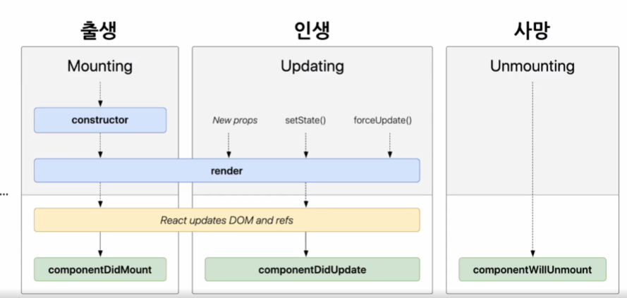

## State

- React Component의 변경 가능한 데이터
- 렌더링이나 데이터 흐름에 사용되는 값만 state에 포함시켜야 함

```JavaScript
class LikeButton extends React.Componenet {
    constructor(props) {
        super(props);

        this.state = {
            liked: false
        };
    }
}
```

- 직접 수정하면 안됨

```JavaScript
// state를 직접 수정(잘못된 사용법)
this.state = {
    name: 'Yuri'
};

// setState 함수를 통한 수정(정상적인 사용법)
this.setState({
    name: 'Yuri'
});
```

## LifeCycle

- 리액트 클래스 컴포넌트의 생명주기
  
